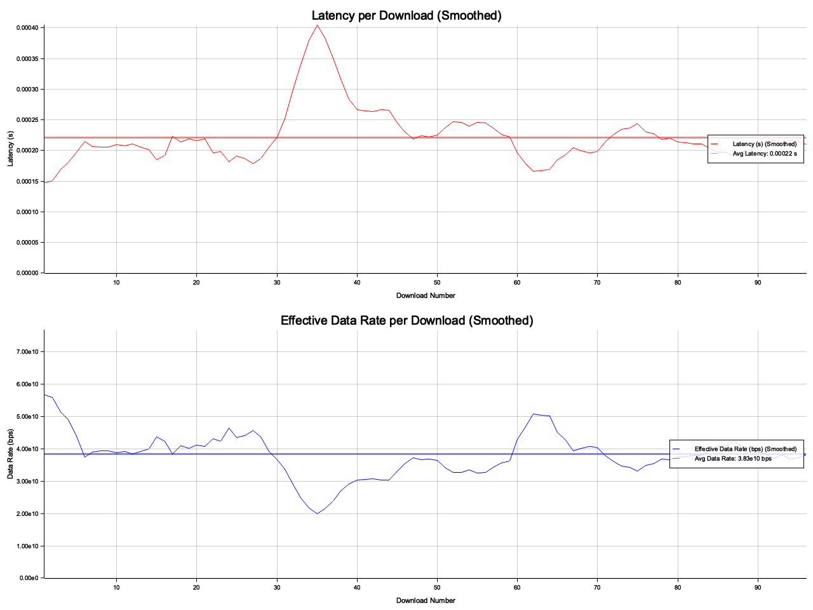

# Bandwidth and Latency Test

This repository contains a client-server application written in Rust to test and analyze network bandwidth, latency, and throughput. The application demonstrates key network performance metrics using formulas for Bandwidth-Delay Product (BDP), Effective Data Rate, and TCP Throughput. It logs metrics to a CSV file and generates charts to visualize latency and data rate trends.

## Features

- **Bandwidth-Delay Product (BDP) Calculation**: Calculates the maximum amount of data that can be in transit in the network.
- **Effective Data Rate Calculation**: Calculates the average data rate achieved over the entire transfer.
- **TCP Throughput Calculation**: Approximates the maximum TCP throughput considering latency and window size.
- **CSV Logging**: Logs each transfer’s latency and effective data rate.
- **Chart Generation**: Visualizes latency and effective data rate over time.

## Getting Started

### Prerequisites

- **Rust**: Ensure that you have Rust installed. If not, you can install it from [https://rust-lang.org](https://rust-lang.org).

### Installation

1. **Clone the Repository**

   Clone this repository and navigate into it:

   ```bash
   git clone https://github.com/davidrhodus/bandwidth-tests.git
   cd bandwidth-tests
   ```

### Run the tests

#### The current command is a quick way to test functionality locally on the same machine. However, for better data and more accurate results, it's recommended to install and run the server on a remote machine.

```bash
# Start the server
cargo run --release --bin server &

# Run the client
cargo run --release --bin client
```

The client connects to the server and performs 100 data downloads, each 1MB in size. The download metrics (latency and effective data rate) are saved to download_metrics.csv, and a chart (latency_data_rate.png) is generated to visualize the trends.



## Technical Details

### Latency

Latency is the time it takes for a packet of data to travel from the client to the server and back, also known as Round-Trip Time (RTT). High latency results in longer delays, impacting throughput, especially in high-bandwidth applications.

Bandwidth-Delay Product (BDP)
The Bandwidth-Delay Product (BDP) represents the maximum amount of data that can be in transit in the network at any given time. This is calculated as:

```
BDP = Bandwidth × RTT
```

Where:

- Bandwidth is the available network bandwidth in bits per second (bps).
- RTT is the round-trip time in seconds.

BDP indicates the capacity of the network “pipe.” For high-latency networks, achieving optimal throughput requires a TCP buffer (or window size) at least as large as the BDP to keep the data pipeline full without pauses.

Effective Data Rate
The Effective Data Rate is the average data rate achieved over the entire transfer, factoring in the total data transferred and the total time taken. It is calculated as:

```
Effective Data Rate = Total Data (bits) / Total Time (s)
```

Effective Data Rate provides insights into the actual throughput achieved during the test, accounting for both network and application-layer inefficiencies.

TCP Throughput
TCP Throughput is a measure of the data rate TCP can achieve under given network conditions. It’s calculated based on the size of the congestion window and RTT:

```
TCP Throughput = Window Size (bits) / RTT (s)
```

Where:

- Window Size is the size of the TCP congestion window in bits.
- RTT is the round-trip time in seconds.

TCP Throughput represents the upper limit on the data rate that TCP can achieve, assuming an ideal congestion window and network path.

### Example Usage of Formulas in Code

The code calculates these metrics as part of the client’s download loop.

- BDP Calculation: calculate_bdp(bandwidth_bps, rtt_seconds)
- Effective Data Rate Calculation: calculate_effective_data_rate(total_data_bits, total_time_seconds)
- TCP Throughput Calculation: calculate_tcp_throughput(window_size_bits, rtt_seconds)

These functions are designed to encapsulate each formula, making them reusable for different network conditions.

### Output

- CSV File (download_metrics.csv)
  Contains logs for each download, with the following columns:

Chunk number
Download time (seconds)
Effective data rate (bps)
Charts (latency_data_rate_chart_refined.png)
Latency Chart: Shows the download latency over each attempt.
Effective Data Rate Chart: Shows the data rate achieved in each attempt.
